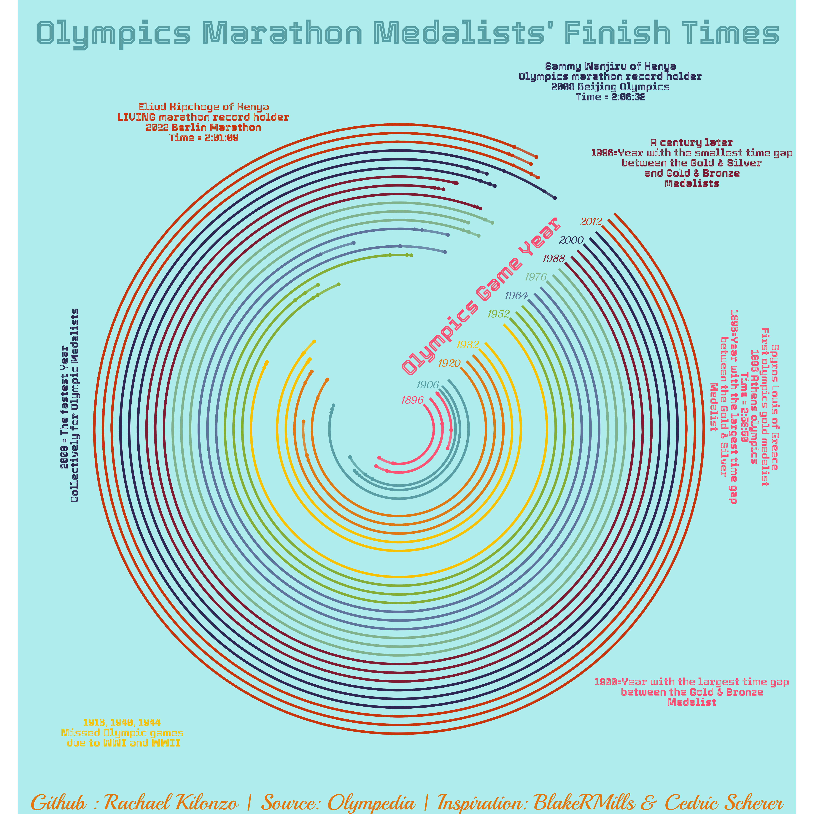
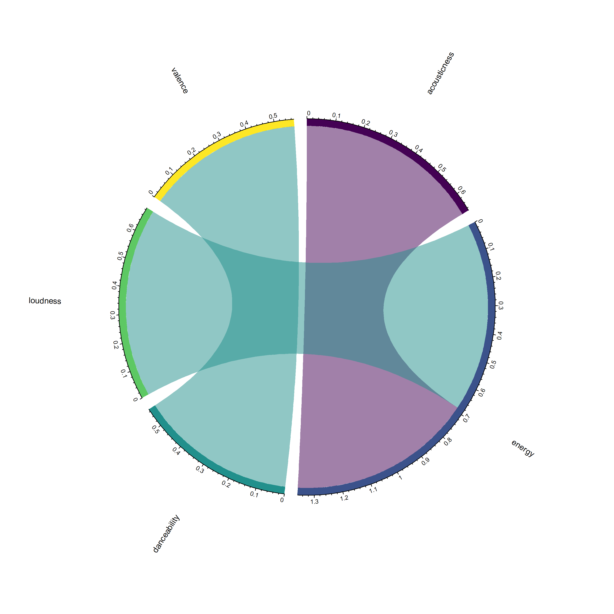
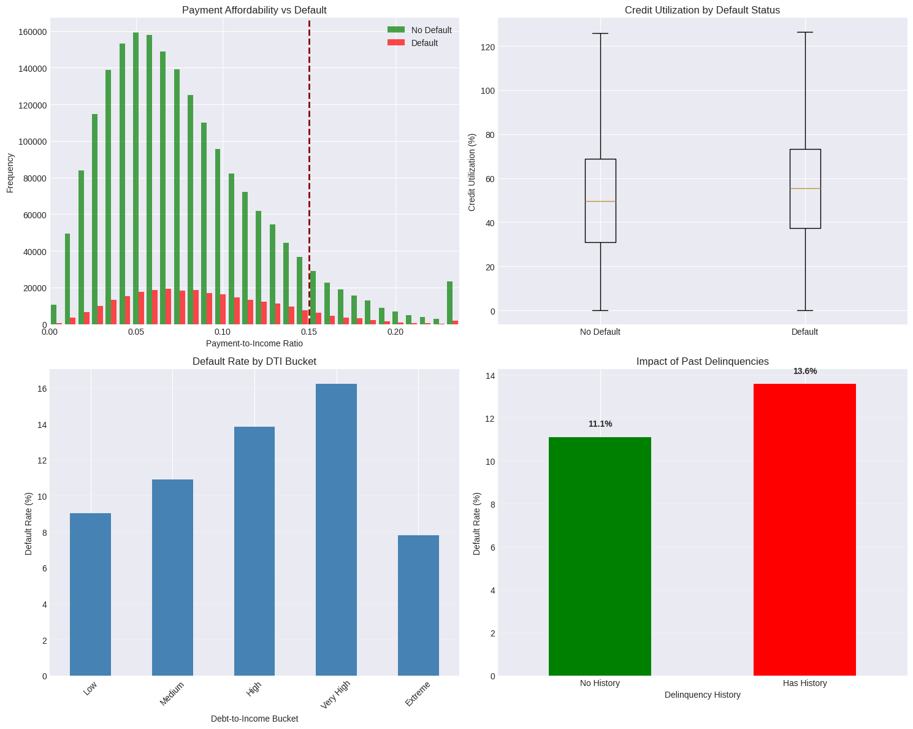

# Data-Science-Portfolio

A curated collection of data science projects focusing on Exploratory Data Analysis (EDA), Web Scraping, Sentiment Analysis, and Data Visualization. Includes diverse datasets ranging from Olympic sports and urban mobility to literary analysis and public health trends. Built with Python, R, and Jupyter Notebooks to showcase data storytelling.

---

### [Tokyo Decathlon Project](./Tokyo-Decathlon)

---

### [Olympics Marathon Project](./Olympics-Marathon)

---

### [Music Evolution Project](./Music-Evolution)

---

### [African Authors: Novelists Information Retrieval](./African-Authors)
This project utilizes web scraping (BeautifulSoup) to retrieve information about novelists. It processes data on author names, birth years, and countries to enrich literary datasets and generate meaningful insights into African literature.

---

### [Credit Risk Prediction Underwriting Framework](./Credit-Risk-Prediction-Underwriting-Framework)

---
### VORONOI OF UNESCO CULTURAL HERITAGE SITES
 [Voronoi Tree Map of the total UNESCO heritage sites found in each country.](./Voronoi-of-UNESCO-cultural-heritage-sites) 

 ---

### [Sentiment Analysis on Death Note](./Sentiment-Analysis)

